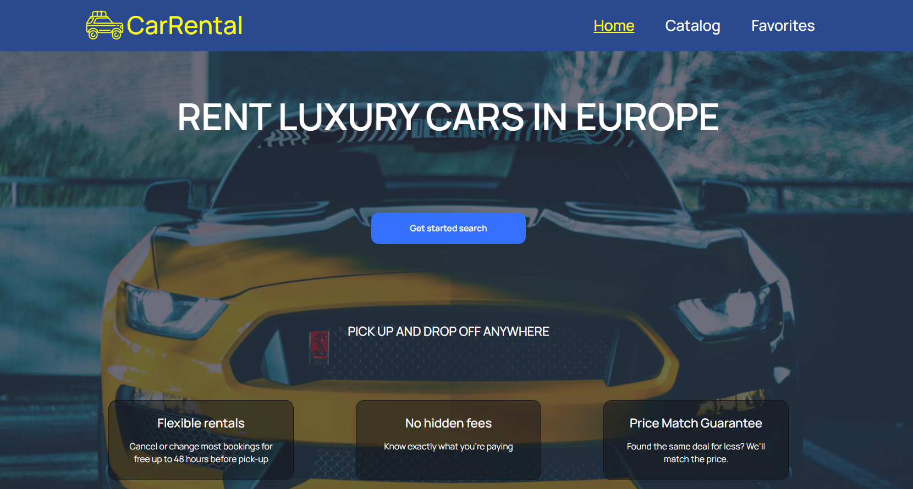

# RENTAL CAR APP

Web application for car rental. In this application, you can filter cars
by the selected options and save to favorites

Live Page -
[yuriyatamanenko.github.io/CarRentalApp/](yuriyatamanenko.github.io/CarRentalApp/)

## Technologies Used

- React.js: JavaScript library for creating user interfaces;
- TypeScrypt: extends JavaScript by adding types to the language;
- React-Router-Dom: Declarative routing for React web applications;
- Styled-Components: Styling library for React components;

## Getting Started

To get started with this project, follow the installation instructions below.

## Installation

1. Clone the repository:

   git clone
   [https://github.com/YuriyAtamanenko/CarRentalApp.git](https://github.com/YuriyAtamanenko/CarRentalApp.git)

2. Install the dependencies:

   npm install

3. Start the development server:

   npm start
